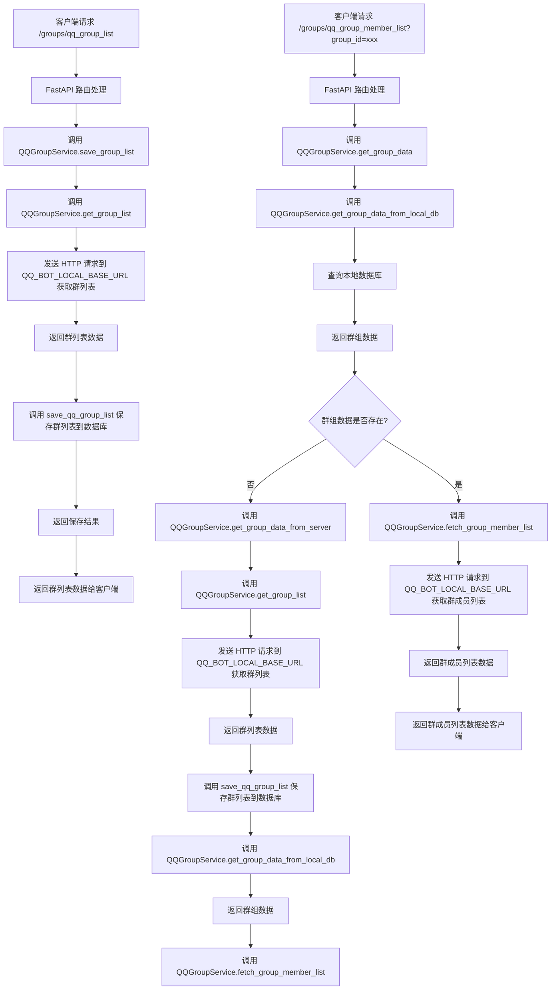

# MsgWatcher

[TOC]


---

## 项目简介

本项目通过调用各类聊天程序(如QQ或微信)的监控接口，将数据落地，用于后续对于部分聊天信息的下载 - 解析 - 存储。


## 项目依赖


### 开发环境

> Python 3.10.15 | packaged by conda-forge | (main, Oct 16 2024, 01:15:49) [MSC v.1941 64 bit (AMD64)] on win32

Python依赖：requirement.txt


### 依赖服务

**QQ**

> [LLOneBot](https://llonebot.github.io/zh-CN/)
>
> [LLOneBot/LLOneBot： 一种插件，支持 OneBot 11 和 Satori 协议](https://github.com/LLOneBot/LLOneBot)

**本地数据库**

根目录需要创建数据库,目前使用SQLite3,名称为db.sqlite3


## 运行方法


### uvicorn启动

```powerhshell
uvicorn app.main:app --host 127.0.0.1 --port 8000 --reload
```


## 项目&功能介绍

> app/
>
> - main.py - FastAPI 应用的入口文件，包含应用初始化和路由注册。
> - api/
>   - router.py - 定义和注册 API 路由。
>   - v1/
>     - groups.py - 定义获取QQ群列表和获取指定QQ群成员列表的 API 接口。
> - db/
>   - dao/
>     - groups_dao.py - 数据访问对象，包含对 QQ 群组信息的数据库操作。
>   - database.py - 数据库初始化和关闭函数。
> - models/
>   -  QQgroup.py - 定义 QQ 群组的数据模型。
> - services/
>   -  api.py - 定义 API 接口路径。
>   -  exception.py - 定义自定义异常类。
>   -  groups_svc.py - 提供 QQ 群组相关的服务层逻辑。
>   -  schemas.py - 定义数据模型和响应模式。
>   -  server_api.py - 定义服务器 API 基础 URL。


### 主要功能

- **API 路由和接口**：
  - 通过 FastAPI 定义和注册 API 路由，提供获取QQ群列表和获取指定QQ群成员列表的接口。
  - 主要文件：[`app/api/v1/groups.py`](app/api/v1/groups.py)、[`app/api/router.py`](app/api/router.py)

- **数据库操作**：
  - 使用 Tortoise ORM 进行数据库操作，包括初始化数据库、生成数据库模式、插入和查询数据。
  - 主要文件：[`app/db/database.py`](app/db/database.py)、[`app/db/dao/groups_dao.py`](app/db/dao/groups_dao.py)

- **数据模型**：
  - 定义 QQ 群组的数据模型，包括群组的基本信息，如群组 ID、名称、备注、创建时间、成员数量等。
  - 主要文件：[`app/models/QQgroup.py`](app/models/QQgroup.py)

- **服务层逻辑**：
  - 提供服务层逻辑，包括从服务器获取群组列表、保存群组列表、获取群组成员列表等。
  - 主要文件：[`app/services/groups_svc.py`](app/services/groups_svc.py)

- **异常处理**：
  - 定义自定义异常类，用于处理服务层的异常。
  - 主要文件：[`app/services/exception.py`](app/services/exception.py)

- **配置和依赖管理**：
  - 使用 [`requirements.txt`](requirements.txt) 文件管理项目依赖，使用 [`environment.yml`](environment.yml) 文件管理 Conda 环境。

- **调试和测试**：
  - 提供 VSCode 调试配置和 HTTP 请求测试样例，方便开发和调试。
  - 主要文件：[`tests/test.http`](tests/test.http)




## 调试


### VSCode

项目中可以使用VSCode的Debug功能调试unicorn, 相关调试配置位于.vscode中.


### 依赖服务检查

**QQ**

1. QQNT 安装 LLOneBot 插件 [Releases · super1207/install_llob](https://github.com/super1207/install_llob/releases)
2. 启动QQNT，打开设置查看 `LLOneBot` 插件是否启用
3. 浏览器检查 LLOneBot 服务

```shell
http://127.0.0.1:3000/
```
如果显示"LLOneBot server 已启动" 说明和QQ机器人 依赖服务工作正常

### 本地接口调试

根提供`tests/test.http`，提供部分样例，可使用`REST Client`插件直接调试


## 开发备注

- 项目使用 `Black` 进行格式化


## To-do List

- [ ] QQ 聊天记录的落地
- [ ] 指定QQ群，指定人的消息按时间落地
- [ ] 将消息中的文字、图片、文档分类存储起来